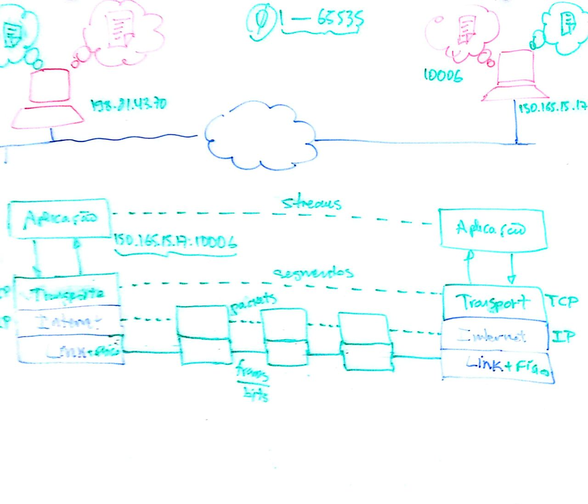

class: center, middle
# Como funciona a _web_&nbsp;?
### ©2018 Dalton Serey
<!-- .center[] -->

---
# Objetivos de aprendizagem

Ao final da aula, **você deve ser capaz de**...
--
count: false

1. explicar como funciona a _world wide web_;
--
count: false

1. explicar como dois programas podem se comunicar pela internet;
--
count: false

1. criar um site elementar composto de: _i_) um backend simples
escrito em JavaScript (_node_) que serve um dado simples; _ii_)
um frontend simples composto de um arquivo html e um arquivo
_JavaScript_;
--
count: false

1. explicar em detalhes, como se articulam as partes do site,
para formar um sistema web funcional;
--
count: false
1. entender e reproduzir o _workflow_ de trabalho típico de
desenvolvimento de sistemas web.

---
# _Hello, World!_ (web)

### Especificação
--
count: false

- um site que ao ser acessado exibe a mensagem `Hello, World!`
--
count: false

- mas que, na verdade...
--
count: false
  - tem um _frontend_ que busca uma mensagem no backend
--
count: false
  - tem um _backend_ que fornece um json contendo a mensagem

--
count: false
### hora de programar...

--
count: false
O _Hello, World!_ que fizemos em sala de aula estará disponível em:
- fontes: http://www.dsc.ufcg.edu.br/~dalton/projsw-20181/hello/
- site: http://150.165.15.17:10006
- deixarei esses dados disponíveis por pouco tempo

---
# O que podemos aprender do exemplo?
--
count: false

### Precisamos nos perguntar e responder...
--
count: false

- que decisões foram tomadas (_design_, _projeto_)?
--
count: false

- quais são as decisões estruturantes (_arquitetura_)?
--

count: false

- e quais as consequências dessas decisões?

--
count: false
 
Ao longo desta e das próximas aulas, discutiremos
respostas para estas questões. E também como podemos
aproveitar essas respostas ao construírmos outros sistemas.

---
class: center, middle
## Como programas em máquinas diferentes interagem?

#### Ou, como funciona a internet?
---
class: center, middle
### conexões host a host (desenho?)

---
class: center, middle
## Suíte de Protocolos Internet

---
# Sugestões de estudo

Faça uma busca por materiais (bem) introdutórios sobre a
arquitetura e o funcionamento da Internet (posts ou vídeos são
suficientes). Você deve entender o design sobre o qual se apoia a
Internet e, em particular, os protocolos TCP e IP. Tenha em mente
que este não é um curso de redes, mas de desenvolvimento de
software. Logo, não se preocupe com detalhes e pormenores por
ora. Desenvolva um modelo mental que lhe permita explicar como
programas operam sobre a Internet, usando o protocolo TCP e as
garantias que oferece.

**Assista aos vídeos**. Apresenta o conceito central de uma rede de
pacotes no nível IP e de conexões seguras com TCP. O próprio Vint
Cerf fala no vídeo. O terceiro vídeo é bem interessante também,
embora mais monótono.

- [The Internet: IP Addresses & DNS](https://www.youtube.com/watch?v=5o8CwafCxnU)
- [The Internet: Packets, Routing & Reliability](https://www.youtube.com/watch?v=AYdF7b3nMto)
- [Introduction to TCP/IP](https://www.youtube.com/watch?v=b9HafRqtVWc)

Depois de assisti-los, ache alguns amigos leigos interessados e
explique a eles como funciona a internet! Melhore sua explicação
a cada oportunidade. Desenhe os elementos de rede envolvidos.

---
# Responda

- Quais os principais componentes de uma aplicação web moderna?
- Uma aplicação web moderna é um sistema distribuído? Por quê?
- Podemos dizer que é uma aplicação cliente-servidor?
- Como uma é enviada pela internet até seu destino?
- Por que o protocolo IP é dito ser _connectionless_ (sem conexão)?
- O que quer dizer a frase “TCP é um protocolo orientado a conexão”?
- O que quer dizer a frase “TCP oferece um serviço fim a fim confiável”?
- O que é um _stream_ TCP?
- O que são sockets?
